# **Pickaxe World**
## **Introduction**

Welcome to Pickaxe World, a play-to-earn RPG that is played using unique and rare NFTs. These NFTs come with their own specific attributes, such as type, rarity, level, and other individual attributes that can be improved through the available rewards. All of these resources come together to create a magic, fantastic RPG world in the special nostalgic form of pixel art.

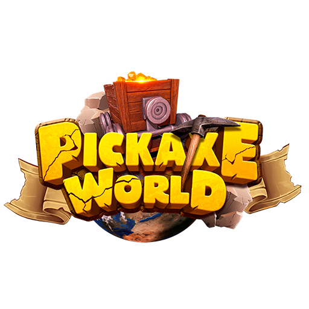

## **How the Pickaxe World works**

To start, the player will need 3 types of Pickaxe Item (NFT): a pickaxe, a miner, and a mine. After that, they can mine and find minerals and precious stones in the mines. These minerals and precious stones will be stored in the player's bag and can be retrieved and transformed into PCS (Precious Carbon Steel) and finally they will be stored in the player's wallet.

The levels of the Pickaxe Item (NFTs) pickaxe, miner, and mine can be increased by the player using PCS (Precious Carbon Steel), so that their NFT will become absolutely unique and invaluable within the game's economy system. The player can sell their NFTs whenever they want, and thus they will move the economy.
They can also sell quantities of PCSs that they won while playing the game.

## **How the game works**

The game's dynamics work through turns. The players can use their miners, along with the pickaxe to find minerals in the mines. The intervals between the turns will be of 24 hours, that is, the player will only be able to mine once a day each mine.

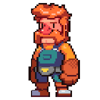
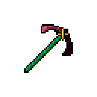
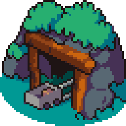

#
# **Precious Carbon Steel - PCS**
## **Reward token**

The PCS token is the reward token on Pickaxe World. The main purpose of the PCS token is to increase the Pickaxe Item (NFTs) levels and all their attributes. The only way to get PCSs is to earn them during the game or to buy them from another user.

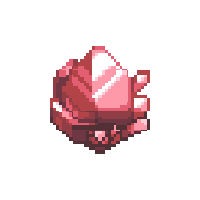

## **PCS Economy Distribution**

There are no pre-minted PCS tokens. They will be minted when users claim their rewards (minerals) inside the game. In other words, the economy will be self-regulated, without any mediation.

## **Level up of Pickaxe Item (NFTs) and using PCS token**

The player can use their PCS tokens to improve the Pickaxe Items (NFTs). The value needed to level up the Pickaxe Item (NFTs) is going to depend on their level, type, and rarity. 
The PCS tokens spent in this process are going to be distributed as follows:

***We are still defining the destiny and the final values for each one of these transactions. It is going to be defined before the launch of the all tokens.***

**25%** is given to the designated wallet of the game admin. This allows us to sustain centralized web servers, middleware, and everything related to all services responsible for maintaining the security and sustainability of the game.

**50%** is burned. This will continuously increase the PCS token value by implementing a consistent burn mechanic and deflating the supply.

**25%** will be sent to the Pickaxe World token governance (PEW) holders to reward our community and players.

#
# **Pickaxe Item (NFTs)**
## **NFT token**

Pickaxe Item is the main non-fungible token in Pickaxe Game. The major difference between other NFTs on the internet and Pickaxe Item is that the latter contains very specific attributes which make them unique and rare, and, of course, very valuable.

Pickaxe Items are composed by types, rarity, and level, each one with its specific attributes, such as power, maximum miners, luck, speed, stamina, and, of course, upgradability.

### **Types**

The type of Pickaxe Item (NFTs) determines the type of attributes each one is going to have.

\- Pickaxe

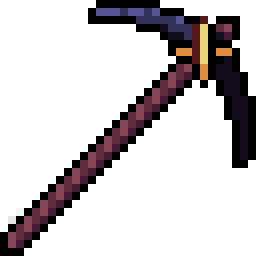

\- Miner

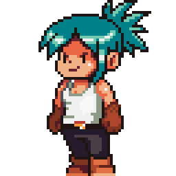

\- Mine

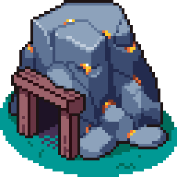

### **Rarity**

The rarity of Pickaxe items (NFTs) determines the percentage of minerals the user may earn during the mining process.

\- Common

\- Uncommon

\- Rare

\- Super Rare

\- Legendary

### **Level**

The players can level up their Pickaxe Items from level 1 to level 15.

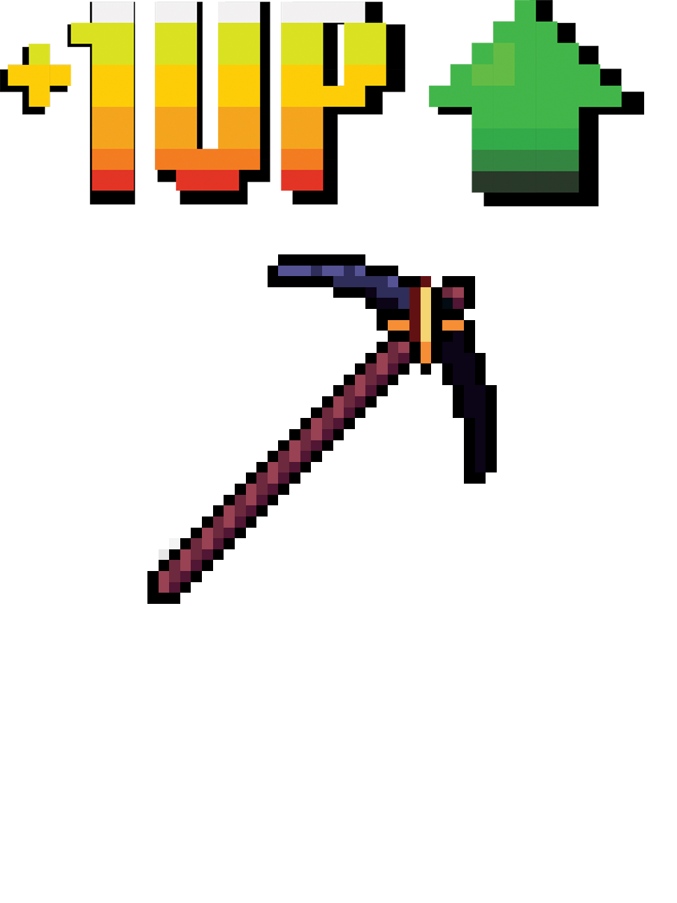
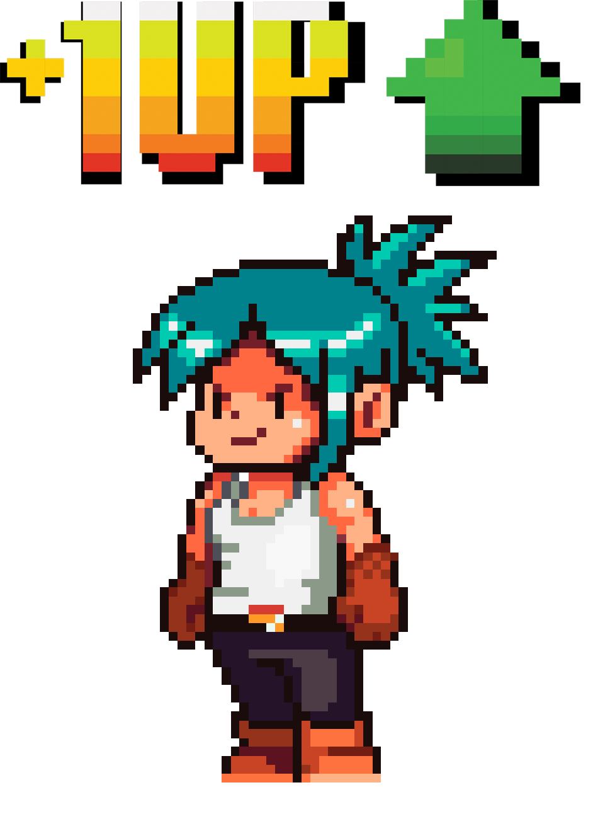
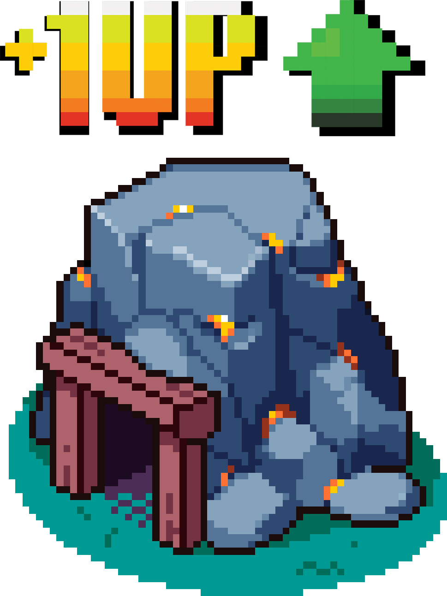

### **Specific attributes**

Each Pickaxe Item type contains different attributes, which can be increased when the players level up their NFT.

***Pickaxe -*** Power, Speed

***Miner -*** Power, Stamina

***Mine -*** Luck, Maximum Miners

## **Upgrade/Evolve**

Here is a small preview of how this feature works:

In the near future based on the road map. We are going to create a new kind of NFT, the Pickaxe Material. The Pickaxe Material is going to be found and earned during the mining process.

Imagine that the player found a Pickaxe Material of gold type, then they can use it to forge with Pickaxe Item a new kind of NFT.

Basically, the player will forge a new NFT using the Pickaxe Item and the Pickaxe Mineral, as raw material (payment).

These new NFTs types are going to be the most unique item in the entire game.

**This feature is disabled, but, it is going to enable it in the future, please see the road map.**

**The upgrade/evolve feature could be changed through the roadmap and the community opinion. It is going to be discussed on social media.**

## **Pickaxe Item Economy Distribution**
Pickaxe Item is unique, valuable, and profitable because they are digital assets that are not subject to double-spending. All Pickaxe Item attributes are stored on-chain (decentralized), which provides a secure and tamper-proof record of ownership about its type, level, rarity, and other attributes. 

Pickaxe Item is also a great way to hedge against inflation, as its value is not subject to the same macroeconomic forces that fiat currencies are.

#
# **Pickaxe World - PEW**
## **Token**
PEW is an ERC-20 governance token for the Pickaxe World game. PEW tokens can be used to purchase in-game items, vote on game decisions, and receive rewards for participating in the game.

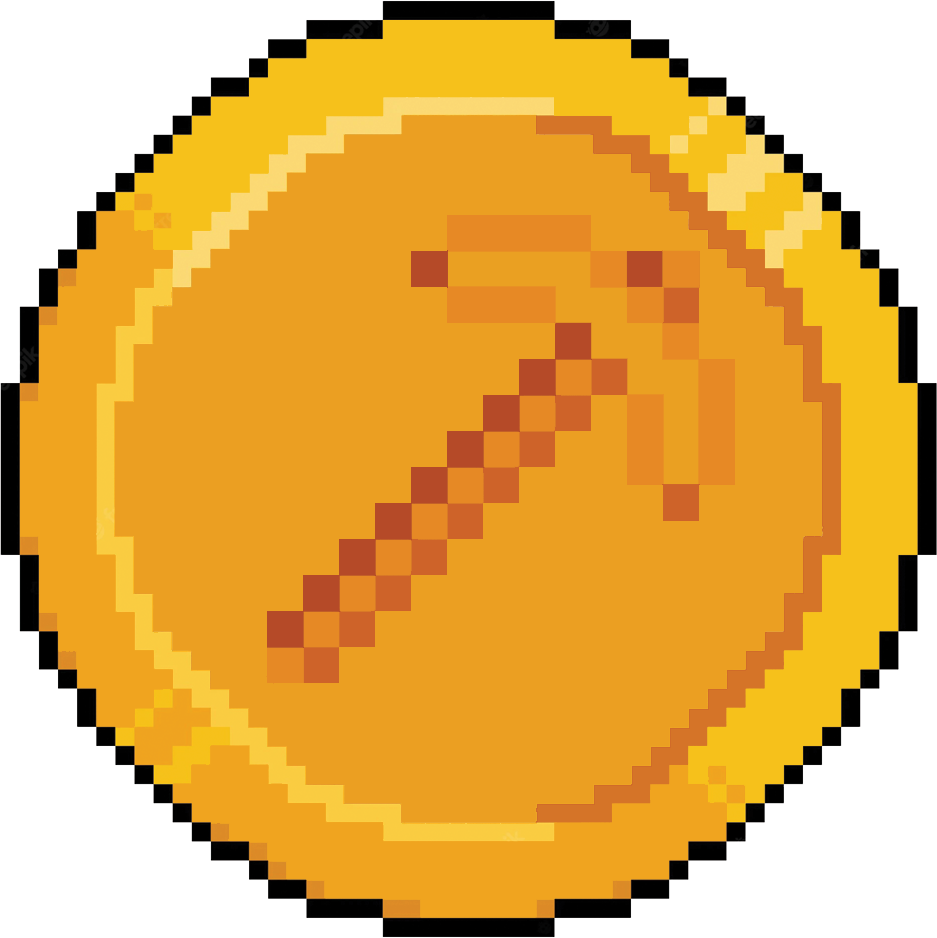

## **PEW token holders reward**

The mechanisms described in Pickaxe World PEW are designed to reward players for interacting with the game while simultaneously encouraging them to spend their PCSs tokens to level up their Pickaxe Items (NFTs) and also to hold on to their PEW tokens so that they can claim additional rewards. At the beginning of 2023, the community treasury will go live. 

The Community Treasury will begin to receive revenues generated by Pickaxe World as well as staking rewards paid in PCS tokens.

The Community Treasury receives inflows from:

**\* 25% of PCS tokens spent on all Pickaxe Item (NFT) level-up transactions.**

#
# **BSC Compatibility**

All PCS tokens and NFTs of the Game will be stored on the Binance Smart Chain (BSC).

#
# **Roadmap**
Please note that our priorities may change based on feedback from the community and new research. Pickaxe World is a game that uses cutting-edge technology that may be unstable or risky.

Our roadmap is subject to changes at any time without notice.

We will continue to update this roadmap as the game develops.

**Q2 2022:**

Pickaxe World project launching

+ NFTs sales via mystery box
+ Pickaxe World (PEW) token (governance) sales

**Q3 2022:**

Pickaxe World Version Beta

+ Marketplace for Pickaxe Item (NFTs)
+ Game (beta)

**Q4 2022:**

Pickaxe World Version 1.0

+ Game:
  + Pickaxe Item Level up feature

**Q1 2023:**

+ MarketPlace
+ Upgrade/Evolve feature

**Q2 2023:**

+ Pickaxe World (PEW) staking

**Q1 2024:**

Pickaxe World Version 2.0

+ Mobile game

**Q2 2024:**

+ PVP

The endgame is to create a single application that players can use to interact with the entire Pickaxe World:

- Marketplace
- Social network
- PVP (Q3 2024)
- Mobile

#
# **Team**

Pickaxe World is being developed by 2 expert software engineers who have already successfully worked on a lot of projects. In 2019 they started studying blockchain and play-to-earn games. Therefore they decided to create a play-to-earn game based on RPGs, which will offer their users the power to increase and evolve the elements (NFTs) inside the game. All artistic decisions are being made according to their artist partner.

The founding team: 

## **Rodrigo - CEO**

Rodrigo leads the Pickaxe World Company and he is involved in all key decisions from production to marketing. He is also responsible for the overall operation of the Pickaxe World Company. This includes managing the day-to-day operations closely together with the COO.

## **Mauro - COO**

Mauro is responsible for the day-to-day operations of Pickaxe World and its various tokens transactions. He works together with the CEO to develop and implement the company's overall strategy.

#
# **Partners**
We are looking for partners to invest in our new game, which can be enjoyed by people who love play-to-earn and RPGs games.